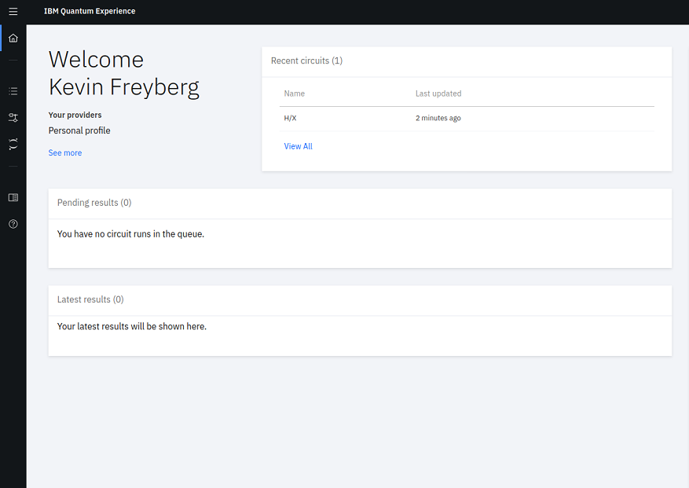
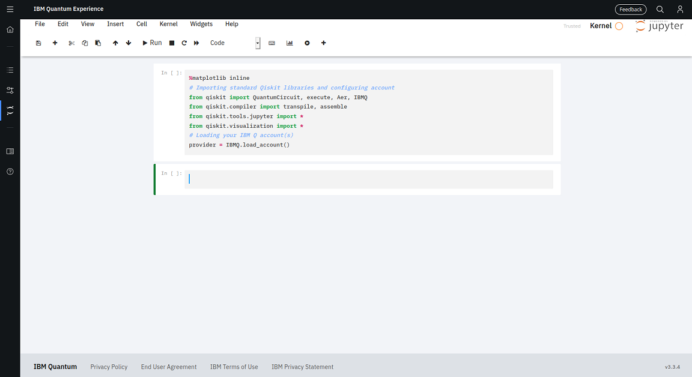

# Getting started with Qiskit!

Qiskit is a powerful open-source framework using for quantum computing. Likewise, it will be useful for tinkering with quantum circuits, and even the simulation of quantum algorithms. For the purpose of this crash-course, we will be using the Quantum Lab on the [IBM Quantum Experience](https://quantum-computing.ibm.com/), rather than working locally. You will need to make an account.

Upon making your account, you will led to the dashboard. It should look something like this:

To enter the Quantum Lab, select this icon on the left panel:

Simulations on the Quantum Lab are performed with the help of Project Jupyter. To start, select this following icon to create a new notebook:

Select your new notebook and open it. You will be a presented with a screen like so:

