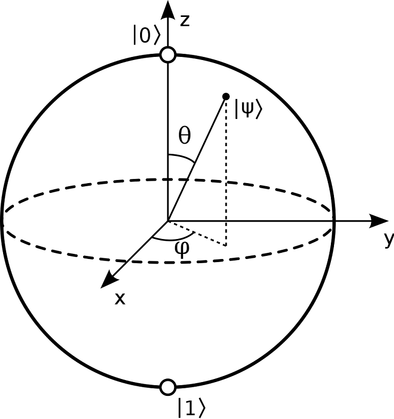
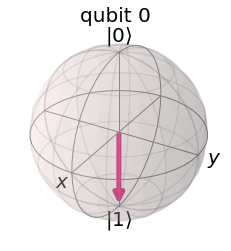
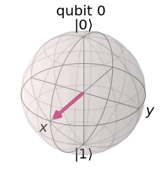

# Episode II: Statevectors & the Bloch Sphere

In this episode, we will introduce statevectors, Bloch spheres, and their representations in Qiskit. You will learn how to utilize different simulators in Qiskit and develop a better understanding of your qubit states.

## Introduction to Statevectors

In seminar you have been introduced to the concept that any "closed" quantum system can be modeled as a vector. Statevectors are used to model the state of our quantum system.

In [Episode I](https://kevinfreyberg.github.io/Qiskit-Crash-Course/seminar-1/), we have demonstrated this when we intialized our qubit states. 

As a reminder:

```python
state = [0, 1] # This is a statevector for |1⟩
circuit.initialize(state, qubit0) # Initializes qubit0 to state |1⟩
```

In matrix form, this is what our statevector looks like:

*TO-DO: Insert math w/ LaTeX*

Statevectors will prove to be incredibly useful when we discuss multi-qubit representations. However, for now, we will focus on statevectors for single qubits.

## Qiskit Simulators

Qiskit offers different simulators depending on what you're working with, and how you want to simulate your circuits. In [Episode I](https://kevinfreyberg.github.io/Qiskit-Crash-Course/seminar-1/), you might have noticed that we utilized the "qasm" simulator like so:

```python
backend = Aer.get_backend('qasm_simulator') # Loads the qasm simulator
```

Essentially, the "qasm" simulator is used to to emulate a *real* quantum computing. 

Now, you might be scratching your head and wondering: isn't that the point of this whole thing? Well, this depends on how you want to simulate. On a *real* quantum computer, if you want to observe the states of your qubits during the execution of your program, you would end up destroying them. 

Luckily, we can *cheat* a bit and avoid this. Qiskit offers the statevector simulator, which allows us to look at our qubit states before we measure. You can think of it as a VIP pass to our qubits:

```python
backend = Aer.get_backend('statevector_simulator') # Loads the statevector simulator
```

As we move on, we will use the statevector simulator for representing our statevectors.

## Using the Statevector Simulator

Let's start by defining a function for our statevector simulations:

```python
def statevec(circuit):
    backend = Aer.get_backend('statevector_simulator') # Loads the statevector simulator
    data = execute(circuit, backend).result().get_statevector() # retrives results and statevector from simulation
    print("Statevector: ", data) # Present data

    # * Note *, you can also use the "return plot_histogram(data)" to represent the data with a histogram rather than the print statement
```

Now, let's create a basic circuit with one qubit, and one classical bit:

```python
qubit0 = QuantumRegister(1, name = "qubit0")
classic_bit0 = ClassicalRegister(1, name = "classic_bit0")
circuit = QuantumCircuit(qubit0, classic_bit0)

state = [0, 1] # This is a statevector for |1⟩
circuit.initialize(state, qubit0) # Initializes qubit0 to state |1⟩
```

Our next step is to simulate:

```python
statevec(circuit)
```

When you run the code, your output will look like this: 

```Statevector:  [0.+0.j 1.+0.j]```

Notice how it looks very similar to our state variable in our code, except with a few minor differences. What we see are two complex numbers, where the "j" is the python representation for the imaginary number *i*. 

What if we put the qubit into a superposition? Let's give this a try:

```python
def statevec(circuit):
    backend = Aer.get_backend('statevector_simulator') # Loads the qasm simulator
    data = execute(circuit, backend).result().get_statevector()
    print("Statevector: ", data) # Present data

qubit0 = QuantumRegister(1, name = "qubit0")
classic_bit0 = ClassicalRegister(1, name = "classic_bit0")
circuit = QuantumCircuit(qubit0, classic_bit0)

state = [math.sqrt(1/2), math.sqrt(1/2)]

circuit.initialize(state, qubit0) # Initializes qubit0 to state |1⟩

statevec(circuit)
```

You should find that the output will look similar to this:

```Statevector:  [0.70710678+0.j 0.70710678+0.j]```

Try experimenting with the statevector simulation. Can you make a statevector that has a 1/8 probability of measuring the state `|1⟩`?

## The Bloch Sphere

The Bloch sphere is used to geometrically represent a state space of a qubit. 

This is what it looks like:



The North and South poles of the sphere represent the states `|0⟩` and `|1⟩`, respectively. Essentially, a qubit state can be represented by any point on the sphere, whereas classical bits can only be represented by the North and South poles. 

Bloch spheres are straightforward to use in Qiskit. The following function takes a circuit (assuming with one qubit) and spits out a Bloch sphere representation of the qubits state:

```python
def plot_bloch(circuit):
    backend = Aer.get_backend('statevector_simulator')
    job = execute(circuit,backend).result().get_statevector()
    return plot_bloch_multivector(job)
```

We can actually use our previous circuit that we used for the statevector simulations. 

```python
state = [0, 1]
circuit.initialize(state, qubit0) # Initializes qubit0 to state |1⟩

plot_bloch(circuit)
```

When you run the code, you should see this:



Because we initialized our qubit state to `|1⟩`, our qubit is "spin down" and pointing to `|1⟩`. At this point, you could probably guess what the Bloch sphere would look like if we initialized the qubit state to `|0⟩`. 

Okay, so we can represent qubits as a `|0⟩` or `|1⟩` on the Bloch sphere, so what? Remember that qubits can be placed in a superposition of states, that is, they can be both `|0⟩` and `|1⟩` at the same time!

What in the world would this look like? Let's check it out:

```python
def plot_bloch(circuit):
    backend = Aer.get_backend('statevector_simulator')
    job = execute(circuit,backend).result().get_statevector()
    return plot_bloch_multivector(job)
    
qubit0 = QuantumRegister(1, name = "qubit0")
classic_bit0 = ClassicalRegister(1, name = "classic_bit0")
circuit = QuantumCircuit(qubit0, classic_bit0)

state = [math.sqrt(1/2), math.sqrt(1/2)] 
circuit.initialize(state, qubit0) # Initializes qubit0 to a superposition

plot_bloch(circuit)
```

Now you'll see this:



What happened? We changed basis.

Qiskit initially starts in the Z-basis, but when we initialized our qubit into a superposition, we switched over to the X-basis. When developing your circuits, you have to be extra careful with your measurements--Qiskit only allows measuring in the Z-basis.

## Conclusion

As we travel further along our journey, we will discuss changing bases and expand our toolkit to inch closer towards developing some interesting quantum algorithms. 

For now, let us head over to [Episode III](https://kevinfreyberg.github.io/Qiskit-Crash-Course/seminar-3/)!


