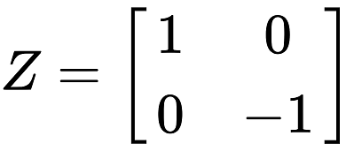

# Episode III: Fundamental Gates

In this chapter, we will introduce quantum logic gates and how to apply them with Qiskit. At the end of this chapter, we will have created a circuit that:
- Applies each of the basic quantum logic gates we have been introduced to on a qubit
- Recreates some of the fundamental quantum logic gates

## The Hadamard Gate

Remember in the previous chapter where we mentioned superposition? 

Hadamard gates put qubits into a superposition.

This is represented by a a *Hadamard Matrix*:


Luckily for us, this is easy to do in Qiskit. Let us demonstrate this through a basic circuit:

```python
qubit0 = QuantumRegister(1, name = "qubit0") # Create a qubit on the quantum register
classic_bit0 = ClassicalRegister(1, name = "classic_bit0") # Create a classic bit on the classical register
circuit = QuantumCircuit(qubit0, classic_bit0) # Create a quantum circuit from our qubit/bit

circuit.h(qubit0) # Applies a Hadamard gate to qubit0
```

Recall from seminar that a applying a Hadamard gate to a qubit means that upon measurement, there is an equal chance to observing a 0 or 1. In other words, you have a 50% chance of observing a 0, and a 50% chance to observe a 1. Additionally, the Hadamard gate is the one-qubit instance for the quantum Fourier transform.

With that being said, the *.h()* method is equivalent to the following code snippet:

```python
state = [math.sqrt(1/2), math.sqrt(1/2)] # This is a vector in the form of a list: [alpha, beta]
circuit.initialize(state, qubit0) # Initializes qubit0 to the defined state
```

An important thing to note is that the Hadamard gate allows you to transform states of qubits between the X and Z bases.

## The X-gate

The X-gate is a NOT gate in quantum computing. It's pretty intuitive and will flip the state of a qubit.

This is represented by a *Pauli-X Matrix*:


This is what it looks like in Qiskit:

```python
circuit.x(qubit)
```

Essentially, the X-gate maps the basis state `|0⟩` to `|1⟩`, and vice-versa.


## The Y-gate

The Y-gate is used for rotation around the Y-axis of the Bloch sphere (by pi radians). 

This is represented by a *Pauli-Y Matrix*:


In Qiskit, it is represented by:

```python
circuit.y(qubit)
```

The Y-gate maps the basis states `|0⟩` to `i|1⟩`, and `|1⟩` to `-i|0⟩`.

## The Z-gate

The Z-gate is known as a phase-flip and is used for rotation around the Z-axis of the Bloch sphere (by pi radians).

This is represented by a *Pauli-Z Matrix*:



In Qiskit, it is represented by:

```python
circuit.z(qubit)
```

The Z-gate does not affect the basis state `|0⟩`, but maps the basis state `|1⟩` to `-|1⟩`.

## Phase Shift Gates

Phase shift gates are important in the creation of advanced quantum algorithms. The R(phi)-gate is used to perform rotations (defined by phi radians) on the Bloch sphere. In fact, the Z-gate is a special case of the R(phi)-gate, where phi = pi. We will continue demonstrate this as we go on.

This is represented by the following matrix:


In Qiskit, the R(phi)-gate is represented by:

```python
circuit.rz(phi, qubit) # where phi is in radians
```

This gate is fundamental for manipulating the spins of qubits around the Bloch sphere in terms of working in different bases.

They map basis states `|0⟩` to `|0⟩` and `|1⟩` to `e^(i*phi)|1⟩`.

## The S-gate

The S-gate is a variation of the R(phi)-gate where `phi = pi/2`. Essentially, it performs a 90-degree z-axis rotation on the Bloch sphere.

In Qiskit, it is represented by:

```python
circuit.s(qubit)
```

The conjugate transpose of the S-gate is known as the Sdg gate (or S-dagger). You can use it in Qiskit with:

```python
circuit.sdg(qubit)
```

It might not be obvious at first, but you can actually recreate the Sdg gate with the relation: Sdg = ZS. 

## Bringing it all together

By applying various combinations of the gates in this chapter, you can actually recreate some of them. For example, the X-gate is simple to implement using just Hadamard and Z-gates. In fact, it is just the relation: X = HZH.

Let's try it:

```python

def simulate(circuit): # this is a helper function for simulating and spitting out counts
    backend = Aer.get_backend('qasm_simulator')
    job = execute(circuit, backend, shots=1000) # Simulate our circuit 1000 times
    result = job.result()
    data = result.get_counts() # Retrieve data
    print("Counts: ", data) # Present data

qubit0 = QuantumRegister(1, name = "qubit0") # Create a qubit on the quantum register
classic_bit0 = ClassicalRegister(1, name = "classic_bit0") # Create a classic bit on the classical register
circuit = QuantumCircuit(qubit0, classic_bit0) # Create a quantum circuit from our qubit/bit

state = [0, 1] # This is a vector in the form of a list: [alpha, beta]
circuit.initialize(state, qubit0) # Initializes qubit0 to state |1⟩

# Refer to the relation defined above and write your code below using only Hadamard and Z-gates. 


circuit.measure(qubit0, classic_bit0) # Perform Z-measurement
simulate(circuit)
```

We initialized our qubit to be in the `|1⟩` state and since the X-gate acts like a NOT gate, you should find that your qubit will measure in the `|0⟩` state every time.

Okay, that might have been too simple. 

Let's try and create the Y-gate using just the R(phi) and H-gates. A simple way to recreate the Y-gate is through the relation: Y = SX(Sdg). Can you implement this without explicitly using the Sdg method?

```python

def simulate(circuit): # this is a helper function for simulating and spitting out counts
    backend = Aer.get_backend('qasm_simulator')
    job = execute(circuit, backend, shots=1000) # Simulate our circuit 1000 times
    result = job.result()
    data = result.get_counts() # Retrieve data
    print("Counts: ", data) # Present data

qubit0 = QuantumRegister(1, name = "qubit0") # Create a qubit on the quantum register
classic_bit0 = ClassicalRegister(1, name = "classic_bit0") # Create a classic bit on the classical register
circuit = QuantumCircuit(qubit0, classic_bit0) # Create a quantum circuit from our qubit/bit

state = [0, 1] # This is a vector in the form of a list: [alpha, beta]
circuit.initialize(state, qubit0) # Initializes qubit0 to state |1⟩

# Refer to the relation defined above and write your code below using only R(phi) and H-gates. 


circuit.measure(qubit0, classic_bit0) # Perform Z-measurement
simulate(circuit)
```

Were you able to do it? Remember that solution code will be provided in the examples folder.

## Conclusion

At this point, we have recreated the X and Y-gates in Qiskit. In the next episode, these gates will prove useful as we go over the use of multiple qubits and entanglement.

Let us head on to [Episode IV](https://kevinfreyberg.github.io/Qiskit-Crash-Course/seminar-4/)!


