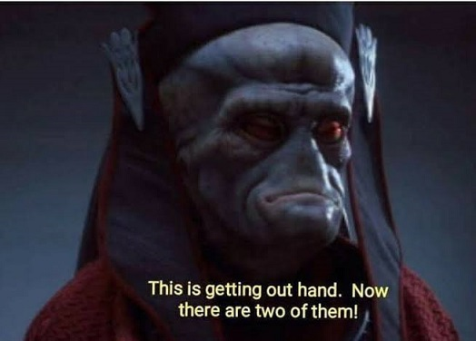

# Episode IV: Quantum Entanglement

In this chapter, we will introduce the use of multiple qubits and how to manipulate them in Qiskit. At the end of this chapter, we will have created a circuit that:
- Creates a bell pair

## The CNOT Gate

The CNOT gate works on two qubits, and is the backbone of creating a Bell pair. 



The first qubit is known as the control  and the second qubit as the target. In Qiskit, it is represented by the *.cx()* method:

```python
circuit.cx(control, target)
```

At first glance, the CNOT gate might appear to have some funky behavior. For one, it leaves the control qubit unchanged. Secondly, it performs an X-gate on the target qubit if the state of the control is `|1⟩`. 

However, when we deal with entanglement, we have a lot to thank the CNOT gate for.

## Bell pair

In simple terms, a Bell pair is an entangled state of two qubits. 

The structure of a Bell pair is quite simple. Among two-qubits, it is created by applying a Hadamard gate on the control qubit, and then applying a CNOT gate on the control and target.

So what does it look like on a circuit?


Let's try it in Qiskit:

```python
qubit0 = QuantumRegister(1, name = "qubit0") # Create a qubit on the quantum register
qubit1 = QuantumRegister(1, name = "qubit0") # Create a qubit on the quantum register

classic_bit0 = ClassicalRegister(1, name = "classic_bit0") # Create a classic bit on the classical register
circuit = QuantumCircuit(qubit0, qubit1, classic_bit0) # Create a quantum circuit from our qubit/bit

circuit.h(qubit0) # Apply a Hadamard
circuit.cx(qubit0, qubit1) # Apply a CNOT
```

Let's slap everything into a function!

```python
def bell_pair(circuit, qubit0, qubit1): # entangles qubits
    circuit.h(qubit0) 
    circuit.cx(qubit0,qubit1) 
```

We can then build our circuit and simulate the results:

```python
def simulate(circuit): # this is a helper function for simulating and spitting out counts
    backend = Aer.get_backend('statevector_simulator')
    job = execute(circuit, backend, shots=1000).result().get_counts() # Simulate our circuit 1000 times
    return plot_histogram(job)
    
qubit0 = QuantumRegister(1, name = "qubit0") # Create a qubit on the quantum register
qubit1 = QuantumRegister(1, name = "qubit1") # Create a qubit on the quantum register

classic_bit0 = ClassicalRegister(1, name = "classic_bit0") # Create a classic bit on the classical register
circuit = QuantumCircuit(qubit0, qubit1) # Create a quantum circuit from our qubit/bit

bell_pair(circuit, qubit0, qubit1)
simulate(circuit)
```

After this process, there are only two possible states: `|00⟩` and `|11⟩`. Essentially, this means that the qubits are *entangled*. 


## Entanglement of qubits

You might have heard of quantum entanglement in a science-fiction movie as some sort of mystical, complicated phenomenon. However, in reality, it isn't *too* complex. In fact, entanglement (let us assume there are two qubits in a Bell state) just means that two qubits share the same quantum state.

This notion of quantum entanglement is used in quantum algorithms, such as Quantum teleportation. In the next chapter, we will actually simulate the teleportation of qubit states. 

Now, we shall travel to the Unknown Regions of [Episode V](https://kevinfreyberg.github.io/Qiskit-Crash-Course/seminar-5/)!

Return to the [Homepage](https://kevinfreyberg.github.io/Qiskit-Crash-Course/)!


