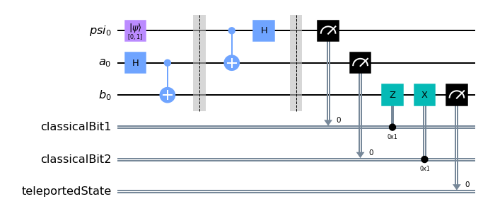
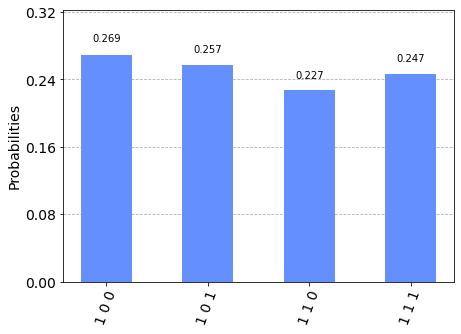

# Episode V: Applying Everything We've Learned--Quantum Teleportation!

In this chapter, we will introduce an interesting algorithm: Quantum Teleportation. By the end of this chapter, we will have created a circuit that:
- Uses our knowledge of Qiskit to simulate teleportation

## Quantum Teleportation?

No, we aren't referring to interdimensional travel. However, quantum teleportation is an interesting notion of sending quantum information through the aid of classical communication and entangled quantum states.

The backbone of teleportation is the no-cloning theorem in quantum mechanics, which states that you cannot make a copy of an unknown quantum state. We will leverage this in our simulation.

## The Algorithm

The following snippet outlines the entire algorithm. It might seem slightly esoteric at first, but we will be able to break this down into Qiskit.

```
Suppose A, B, and |Psi> are qubits. |Psi> = alpha|0> + beta|1>

Alice wants to send qubit state |Psi> to Bob.

Steps:
1. Create entangled pair of qubits (Bell pair)
	-Transfer qubit A to X-basis ( |+> and |-> ) by applying a Hadamard gate. Apply Hadamard to |Psi>
	-Apply a CNOT gate with A as the control, and B as a target.
	-Alice is given qubit A and qubit |Psi>. Bob is given qubit B.

2. Alice applies a CNOT gate with |Psi> as the control, and qubit A as the target.

3. Alice measures qubit A and |Psi> into two classical bits. She sends these two classical bits to Bob.

4. Bob applies certain gates based on the state of the classical bits:
	 00 -> Nothing
	 01 -> X gate
	 10 -> Z gate
	 11 -> ZX gate
```

## Our First Steps

As usual, make sure that you've imported the correct modules into your code. Alternatively, you can just use the following line to import everything from Qiskit if you do not want to use declare any specific modules:

```python
from qiskit import *
```

To start, let us create a helper function using the *qasm* simulator to visualize our quantum states on a histogram.

```python
def simulate(circuit): # this is a helper function for simulating and displaying a histogram
    backend = Aer.get_backend('qasm_simulator')
    counts = execute(circuit, backend, shots=1000).result().get_counts()
    return plot_histogram(counts)
```


Our next step is to initialize our circuit with the right amount of qubits (3) and classical bits (2), along with another classical bit that will represent our "teleported" state. 

```python
cr1 = ClassicalRegister(1, name = "classicalBit1") # Classical bit 1
cr2 = ClassicalRegister(1, name = "classicalBit2") # Classical bit 2
c_result = ClassicalRegister(1, name = "teleportedState") # Classical bit that represents our result

qubit0 = QuantumRegister(1, name = "psi") # The quantum state we want to send
qubit1 = QuantumRegister(1, name = "a") # Alice's qubit
qubit2 = QuantumRegister(1, name = "b") # Bob's qubit
```

We then want to initialize our qubit "Psi" with the correct quantum state. Let us suppose that we want to send the quantum state `|1⟩` to Bob. We can do it like so:

```python
psi = [0, 1] # We want to send |1> to Bob
circuit.initialize(psi, qubit0) # Set the quantum state to psi
```

## Entanglement 

Following the algorithm, we must then create a Bell pair between qubit A and B. Recall from [Episode IV](https://kevinfreyberg.github.io/Qiskit-Crash-Course/seminar-4/) that a Bell pair just refers to a pair of entangled qubits. 

This is straightforward to do and, as a reminder, it can be done by applying a Hadamard gate on qubit A, and a CNOT gate with A as the control and B as the target:

```python
circuit.h(qubit1) # Apply Hadamard to Alice's qubit
circuit.cnot(qubit1, qubit2) # Perform CNOT with Alice's qubit as the control, and Bob's qubit as the target
```

Of course, we can also throw this into a function to keep things neat:

```python
def bell_pair(circuit, q0, q1): # entangles qubits
    circuit.h(q0) 
    circuit.cx(q0, q1) 
```

*Note*: When we design more intricate quantum algorithms, our circuits will start to look a little messy. Qiskit offers a *.barrier()* method that will allow us to visually separate our gates on our circuits. It does not serve any purpose in the quantum algorithm itself.

Continuing our circuit:

```python
circuit.barrier() # Separate our gates so we can see the circuit better
circuit.cnot(qubit0, qubit1) # Perform CNOT with Psi as the control, and Alice's qubit as the target
circuit.h(qubit0) # Apply Hadamard to Psi
circuit.barrier() # Once again, separate our gates so we can see the circuit better
```

This is where Alice applies a CNOT gate with our quantum state `|Psi>` as the control, and qubit A as the target.

## Measurement and Bob's mission

Our next step is to measure our qubits to our classical bits. After this step, Alice sends the classical bits to Bob. This is done in Qiskit like so:

```python
circuit.measure(qubit0, cr1) # Alice measures Psi to our first classical bit
circuit.measure(qubit1, cr2) # Alice measures her qubit to our second classical bit
```

When Bob receives these qubits, he is tasked with a mission: he must apply certain gates depending on the states of the classical bits. Recall step 4 from our brief overview of the algorithm:

```
Bob applies certain gates based on the state of the classical bits:
	 00 -> Nothing
	 01 -> X gate
	 10 -> Z gate
	 11 -> ZX gate
```

Basically, we want both classical bits to be in the `0` state. If Bob is lucky, he'll already have both bits in the `0` state, but more often than not, he'll need to do some work. This is where Bob will need to apply certain gates to his qubit depending on the classical bit states. We can effectively boil this down to the following two lines using circuit methods offered by Qiskit:

```python
circuit.z(qubit2).c_if(cr1, 1) # Apply Z-gate if the first classical bit is 1
circuit.x(qubit2).c_if(cr2, 1) # Apply X-gate if the second classical bit is 1
```

All that's left to do is measure Bob's qubit to our third classical bit and check the result:

```python
circuit.measure(qubit2, c_result) # Measure Bob's qubit to c_result
simulate(circuit)
```

At the very end, our circuit looks like this:



When you run the circuit, you should get a result that looks similar to this:



What we're looking for in each bit string is the *leftmost* bit. Since we wanted to send the state `|1⟩` to Bob, we expect to see `1` as the leftmost bit in each case. We can see that the algorithm worked perfectly as `1` is the leftmost bit 100% of the time. 

To see that this is not just a coincidence, try and send the state `|0⟩` to Bob. 

## Conclusion

We've reached a milestone in our quantum computing journey: we have recreated the seemingly esoteric quantum teleportation algorithm. That wasn't so bad, was it? 

I encourage you tinker with the algorithm and see what happens when we experiment with different states for psi. For example, what will happen if we put psi into a superposition?

As always, the entire circuit source code will be readily available in the `examples` folder on the git repository. 

Return to the [Homepage](https://kevinfreyberg.github.io/Qiskit-Crash-Course/)!


